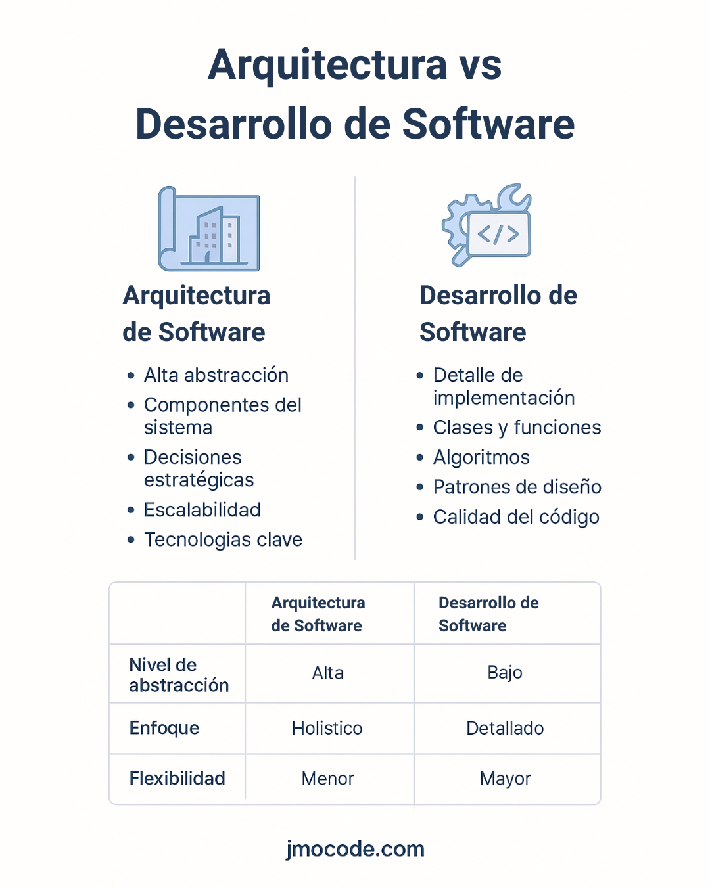

# Arquitectura de Software 🏗️

> Este repositorio tiene fines educativos para aprender sobre Arquitectura y Desarrollo de Software. ¡Toda contribución y ayuda es bienvenida! Si deseas colaborar, no dudes en hacer un pull request o abrir un issue.

## Índice 📑

- [Introducción a la Arquitectura de Software](#introducción-a-la-arquitectura-de-software)
  - [¿Qué es la arquitectura de software?](#qué-es-la-arquitectura-de-software)
  - [¿Qué es el Desarrollo de software?](#qué-es-el-desarrollo-de-software)
  - [Arquitectura vs Desarrollo: Diferencias Clave](#arquitectura-vs-desarrollo-diferencias-clave)
  - [Roles y Responsabilidades](#roles-y-responsabilidades)

- [Principios SOLID](#principios-solid)
  - [Principio de Responsabilidad Única (SRP)](#principio-de-responsabilidad-única-srp)
  - [Principio Abierto-Cerrado (OCP)](#principio-abierto-cerrado-ocp)
  - [Principio de Sustitución de Liskov (LSP)](#principio-de-sustitución-de-liskov-lsp)
  - [Principio de Segregación de Interfaces (ISP)](#principio-de-segregación-de-interfaces-isp)
  - [Principio de Inversión de Dependencias (DIP)](#principio-de-inversión-de-dependencias-dip)
  - [Resumen de SOLID](#resumen-de-solid)

---

## Introducción a la Arquitectura de Software

### ¿Qué es la arquitectura de software? 

La arquitectura de software se puede entender desde tres perspectivas fundamentales:

#### Visión de alto nivel
Es el "esqueleto" o blueprint de un sistema. Define:
- Los componentes principales
- Sus relaciones e interfaces
- Los entornos de ejecución
- Cómo estos elementos se integran para satisfacer tanto requisitos funcionales como no funcionales (rendimiento, disponibilidad, seguridad)

#### Gestión de la complejidad
Proporciona una abstracción para organizar sistemas de gran escala, equilibrando factores críticos como:
- Tiempos de respuesta
- Tolerancia a fallos
- Escalabilidad
- Costos operativos

#### Decisiones estratégicas
Determina aspectos cruciales como:
- Selección de tecnologías
- Estrategias de escalamiento
- Patrones arquitectónicos a evitar
- Decisiones tempranas de alto impacto

### ¿Qué es el Desarrollo de software? 

#### Visión detallada
Define la implementación específica de cada módulo o componente:
- Clases y funciones
- Estructuras de datos
- Algoritmos
- APIs
- Patrones de Desarrollo a nivel local

#### Plan de implementación
- Guía a los desarrolladores
- Describe interfaces y relaciones
- Define métodos para cumplir requisitos funcionales

#### Enfoque práctico
Se centra en aspectos como:
- Corrección del código
- Eficiencia
- Claridad
- Facilidad de mantenimiento

### Arquitectura vs Desarrollo: Diferencias Clave 

| Aspecto              | Arquitectura                                        | Desarrollo 
|----------------------|-----------------------------------------------------|--------------------------------------------------
| Nivel de abstracción | Alto – esqueleto/fundación del sistema              | Detallado – módulos individuales 
| Pregunta clave       | ¿Qué se construye y dónde?                          | ¿Cómo se construye? 
| Enfoque principal    | Componentes, interacción, calidad del sistema       | Clases, métodos, estructuras de datos, algoritmos 
| Requisitos           | Funcionales + No funcionales (seguridad, escalado…) | Principalmente funcionales 
| Flexibilidad         | Rígido – cambios son costosos                       | Más fácil de cambiar y ajustar 
| Ejemplos             | Microservicios, C4, MVC                             | Singleton, Strategy, Builder, etc. 

La arquitectura establece la estructura general y las decisiones de Desarrollo de sistemas completos, mientras que el Desarrollo detalla las piezas individuales, definiendo módulos concretos y el flujo interno para materializar la visión arquitectónica.

### Roles y Responsabilidades 

#### Arquitecto de Software
- Define la estructura general del sistema
- Selecciona tecnologías y patrones
- Alinea la arquitectura con objetivos de negocio
- Balancea aspectos de rendimiento, costo y seguridad
- Interactúa con stakeholders
- Documenta decisiones arquitectónicas
- Lidera visiones cross-equipo (Enterprise vs Solution Architect)

#### Desarrollador de Software
- Traduce la visión arquitectónica en componentes concretos
- Define clases, interfaces y flujos
- Implementa algoritmos
- Desarrolla pruebas unitarias
- Aplica patrones de Desarrollo (creacional, estructural, comportamental)
- Se enfoca en la calidad del código



## Principios SOLID 

### Principio de Responsabilidad Única (SRP) 

**Definición**: Cada módulo o clase debe tener una única razón para cambiar.

La Separación de Responsabilidades (SoC) va de la mano: divide el sistema en partes con responsabilidades distintas.

#### 📌 Ejemplo en Python (malo vs. bien)

❌ **Violación de SRP**: mezcla lectura y compresión
```python
class FileManager:
    def __init__(self, filename):
        self.filename = filename

    def read(self):
        # lee archivo
        pass

    def write(self, data):
        # escribe archivo
        pass

    def compress(self):
        # comprime archivo
        pass

    def decompress(self):
        # descomprime archivo
        pass
```

✅ **Solución**: separa responsabilidades:
```python
class FileManager:
    def __init__(self, filename):
        self.filename = filename

    def read(self): pass
    def write(self, data): pass

class Compressor:
    def compress(self, filename): pass
    def decompress(self, filename): pass
```

### Principio Abierto-Cerrado (OCP) 

**Definición**: Los módulos deben estar abiertos a extensión, pero cerrados a modificación.

#### 📌 Ejemplo en Python

❌ **Violación**: cada vez que agregas un formato, modificas la clase
```python
class Report:
    def output(self, format):
        if format == "json":
            # ...
            pass
        elif format == "xml":
            # ...
            pass
```

✅ **Solución**: usa polimorfismo / interfaces:
```python
class Report:
    def __init__(self, formatter):
        self.formatter = formatter

    def output(self, data):
        return self.formatter.format(data)

class JSONFormatter:
    def format(self, data): pass

class XMLFormatter:
    def format(self, data): pass

# Extender: sólo creas nueva clase Formatter, no modifies Report
```

## Principio de Sustitución de Liskov (LSP) 

**Definición**: Los objetos de una clase derivada deben poder sustituir a la clase base sin cambiar el comportamiento.

#### 📌 Ejemplo en Python

❌ **Violación**:
```python
class Bird:
    def fly(self): pass

class Sparrow(Bird):
    def fly(self): pass  # correcto

class Penguin(Bird):
    def fly(self):
        raise NotImplementedError
# ❌ Violación: Penguin no puede volar, rompe el contrato de la clase base
```

✅ **Solución**: reorganiza la jerarquía:
```python
class Bird: pass

class FlyingBird(Bird):
    def fly(self): pass

class Sparrow(FlyingBird): pass
class Penguin(Bird): pass
```

## Principio de Segregación de Interfaces (ISP) 

**Definición**: Los clientes no deben depender de interfaces que no usan.

#### 📌 Ejemplo en Python

❌ **Violación**:
```python
class Worker:
    def work(self): pass
    def eat(self): pass

class Robot(Worker):
    def work(self): pass
    def eat(self): raise NotImplementedError  # ❌ Violación de ISP
```

✅ **Solución**: define interfaces segmentadas:
```python
class Workable:
    def work(self): pass

class Eatable:
    def eat(self): pass

class Human(Workable, Eatable):
    def work(self): pass
    def eat(self): pass

class Robot(Workable):
    def work(self): pass
```

## Principio de Inversión de Dependencias (DIP) 

**Definición**: Los módulos de alto nivel no deben depender de los de bajo nivel, ambos deben depender de abstracciones.

#### 📌 Ejemplo en Python

❌ **Violación**: Acoplamiento directo
```python
class MySQLDatabase:
    def connect(self): pass

class UserRepository:
    def __init__(self):
        self.db = MySQLDatabase()

    def get_user(self, id):
        self.db.connect()
        # ...
```

✅ **Solución**: depende de una abstracción:
```python
from abc import ABC, abstractmethod

class Database(ABC):
    @abstractmethod
    def connect(self): pass

class MySQLDatabase(Database):
    def connect(self): pass

class UserRepository:
    def __init__(self, db: Database):
        self.db = db

    def get_user(self, id):
        self.db.connect()
        # ...
```

## Resumen de SOLID

| Principio | Qué logra | Ejercicio práctico |
|-----------|-----------|-------------------|
| SRP | Clases con responsabilidad única | Refactorizar FileManager |
| OCP | Sistema extensible sin alterar código existente | Añadir formatos a Report |
| LSP | Subclases compatibles con superclases | Reorganizar jerarquías de pájaros |
| ISP | Evitar interfaces "hinchadas" | Dividir Worker en Workable/Eatable |
| DIP | Acoplamiento a abstracciones | Inyectar Database en repositorio |


