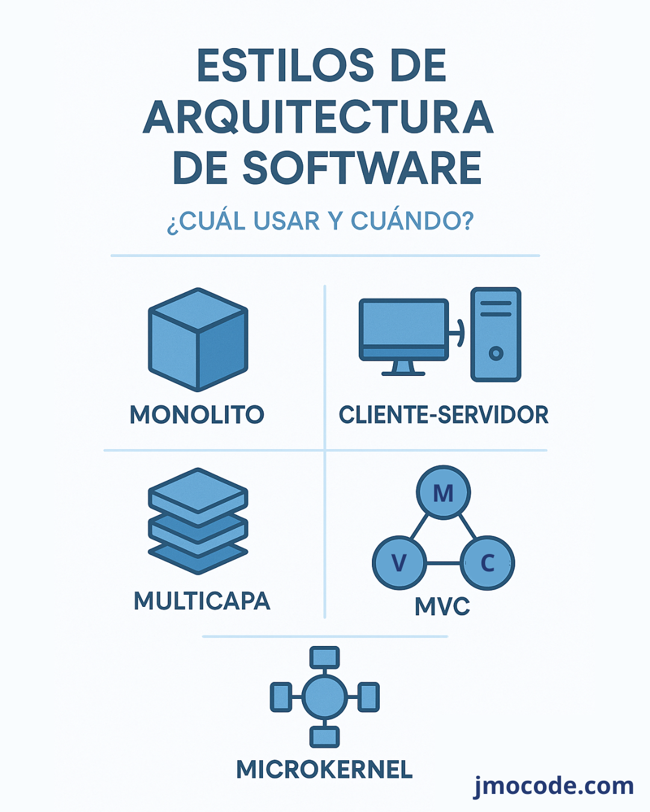

## Estilos Arquitectónicos

### Monolito

#### Definición

Aplicación empaquetada como una sola unidad: UI, lógica de negocio y acceso a datos en el mismo deployment.

#### Ventajas

- Desarrollo y despliegue rápidos; un solo repositorio
- Fácil compartir código (modelos, utilidades) internamente

#### Desventajas

- A medida que crece, mantenimiento y escalabilidad se complican
- Un cambio puede impactar toda la app; difícil escalado

#### Cuándo usarlo

- MVP o proyectos pequeños
- Equipos reducidos con necesidad de velocidad de desarrollo

### Cliente-Servidor

#### Definición

Dos componentes críticos:

- Cliente: interface UX
- Servidor: lógica y datos
- Comunicación por petición/respuesta

#### Ventajas

- Separación clara de responsabilidades
- Puede escalar el servidor

#### Desventajas

- La lógica de negocio queda centralizada; cliente está limitado
- Las variantes de arquitectura (1-tier, 2-tier, n-tier) agregan complejidad

### Multicapa (Layered / N-Tier)

#### Definición

Descompone el sistema en capas:

- Presentación
- Lógica de negocio
- Acceso a datos
  Cada capa comunica solo con la adyacente.

#### Ventajas

- Buena separación de responsabilidades
- Permite reemplazar capas independientemente

#### Desventajas

- Puede volverse lento por múltiples pasos
- Riesgo de acoplamientos innecesarios

#### Cuándo usarlo

- Enterprise apps con lógica compleja

### MVC (Model-View-Controller)

#### Definición

- Modelo: datos y lógica
- Vista: UI
- Controlador: conecta usuario y modelo

#### Ventajas

- Alto grado de desacoplamiento
- Ideal para apps con múltiples canales de UI

#### Desventajas

- Puede ser complejo de implementar en sistemas no triviales

#### Cuándo usarlo

- Frameworks web/mobile (Django, Rails, ASP.NET)

### Microkernel (Plug-in)

#### Definición

Core mínimo con funcionalidades básicas, ampliable con plug-ins independientes.

#### Ventajas

- Extensible sin tocar el core
- Aislamento: un plug-in falla, otros siguen operando

#### Desventajas

- Mayor sobrecarga y complejidad en gestión de plug-ins
- Comunicación inter-módulos puede ser lenta

#### Cuándo usarlo

- IDEs (Eclipse), sistemas modulares, SOs, plataformas con extensiones

### Comparativa de Estilos

| Estilo           | Ventajas principales                          | Desventajas principales                               | Caso de uso típico                        |
| ---------------- | --------------------------------------------- | ----------------------------------------------------- | ----------------------------------------- |
| Monolito         | Simplicidad, velocidad                        | Escalabilidad y mantenimiento complejos               | MVPs, prototipos                          |
| Cliente-Servidor | Separación lógica, escalabilidad              | Lógica concentrada en servidor, variantes complicadas | Apps web clásicas                         |
| Multicapa        | Separación clara, mantenibilidad              | Rendimiento y acoplamientos cruzados                  | Sistemas enterprise                       |
| MVC              | Desacoplamiento UI-lógica-datos, reutilizable | Complejo al escalar                                   | Frameworks web, apps con múltiples vistas |
| Microkernel      | Extensible, modular, aislable                 | Gestión de extensiones costosa, overhead              | IDEs, plataformas con plugins             |

#### Conclusión de estilos arquitectonicos.

- Monolito → para arrancar rápido
- Cliente-Servidor / Multicapa → cuando hay lógica de negocio y UI diferenciada
- MVC → perfecto para aplicaciones orientadas a UI
- Microkernel → cuando quieras flexibilidad máxima y extensibilidad
