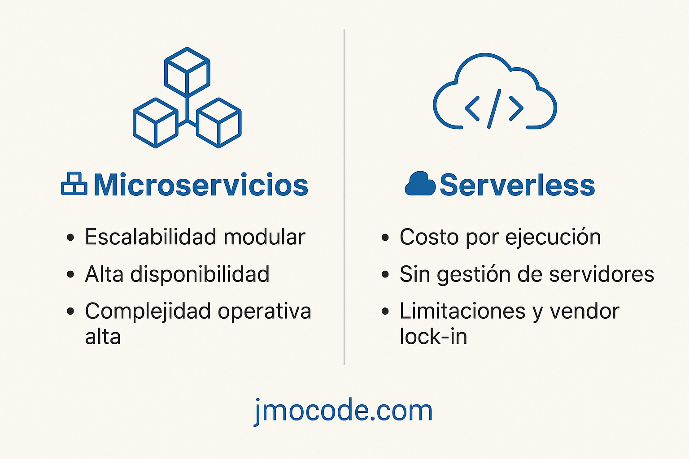

## Estilos de despliegue

### Microservicios

#### Definición

Una arquitectura que divide una aplicación en servicios pequeños e independientes, cada uno con su propia base de datos, lógica de negocio y despliegue.

#### Ventajas

- Escalabilidad independiente: cada servicio puede escalar según demanda
- Despliegue continuo: permite actualizaciones sin afectar el sistema completo
- Tolerancia a fallos: si un servicio falla, los demás siguen operando
- Flexibilidad tecnológica: distintos lenguajes y tecnologías por servicio
- Equipos autónomos: facilita desarrollo paralelo y ramp-up rápido

#### Desventajas

- Mayor complejidad operativa: orquestación, monitoreo, CI/CD, descubrimiento de servicios
- Latencia de red: comunicación vía API introduce sobrecarga
- Consistencia de datos difícil: cada servicio maneja su propio storage
- Costos mayores: más infraestructura, bases, pipelines, logs
- Pruebas y debugging complejos debido a la distribución
- Requiere cultura DevOps madura y habilidades específicas

Nota importante: "If you do not need micro services, do not use them. They will be a pain."

### Serverless (Function as a Service)

#### Definición

Modelo donde ejecutas funciones en la nube sin gestionar servidores. Se activan por eventos (HTTP, colas, cron), con escalado y facturación automática.

#### Ventajas

- Coste por uso real: solo pagas por ejecución, no por capacidad reservada
- Sin infra-ops: no hay que gestionar servidores ni parcheo
- Escalado automático: ajusta capacidad según tráfico
- Desarrollo rápido: enfócate en la lógica sin preocuparte de entorno
- Ecosistema maduro: integración fluida con servicios cloud

#### Desventajas

- Cold starts: retrasos al invocar funciones inactivas
- Vendor lock-in: APIs dependientes del proveedor
- Límites de ejecución: restricción en RAM, CPU, duración
- Debugging y monitorización complejos
- Seguridad distribuida: múltiples puntos de entrada, cada función es un vector potencial
- No ideal para procesamiento prolongado (eternal loops, cargas HPC)

### Comparativa Microservicios vs Serverless

| Característica      | Microservicios                 | Serverless                            |
| ------------------- | ------------------------------ | ------------------------------------- |
| Infraestructura     | Contenedores/VMs + CI/CD       | FaaS, gestión infra nula              |
| Escalado            | Manual/automático por servicio | Totalmente automático                 |
| Facturación         | Recursos provisionados         | Solo por ejecución y uso              |
| Tiempo de respuesta | Estable, baja latencia         | Puede haber "cold start"              |
| Desarrollo          | Flujo flexible, pero complejo  | Muy rápido para funciones específicas |
| Casos típicos       | Grandes apps, dominio claro    | APIs, ETL, cron jobs, eventos         |
| Restricciones       | Complejidad operativa alta     | Límites de tiempo, vendor lock-in     |

#### Casos de uso recomendados

##### Microservicios

- Sistemas grandes, de múltiples dominios
- Equipos autónomos necesitan despliegues independientes
- Necesidad de alta disponibilidad sin romper toda la aplicación
- Escalado granular según carga

##### Serverless

- APIs, procesamiento por evento, tareas programadas
- Startups o prototipos con tiempos al mercado reducidos
- Flujos intermitentes donde no se justifica infraestructura manual
- Integración con servicios cloud (auth, mailing, colas...)

#### Conclusión

- Usa microservicios cuando necesitas independencia, escalado fino y tienes la infraestructura DevOps para gestionarlos
- Usa serverless si buscas rapidez, eficiencia de costos y cargas event-driven ligeras
- En proyectos reales, es común combinar ambos: microservicios gestionan dominio central, mientras funcionalidades auxiliares usan serverless

