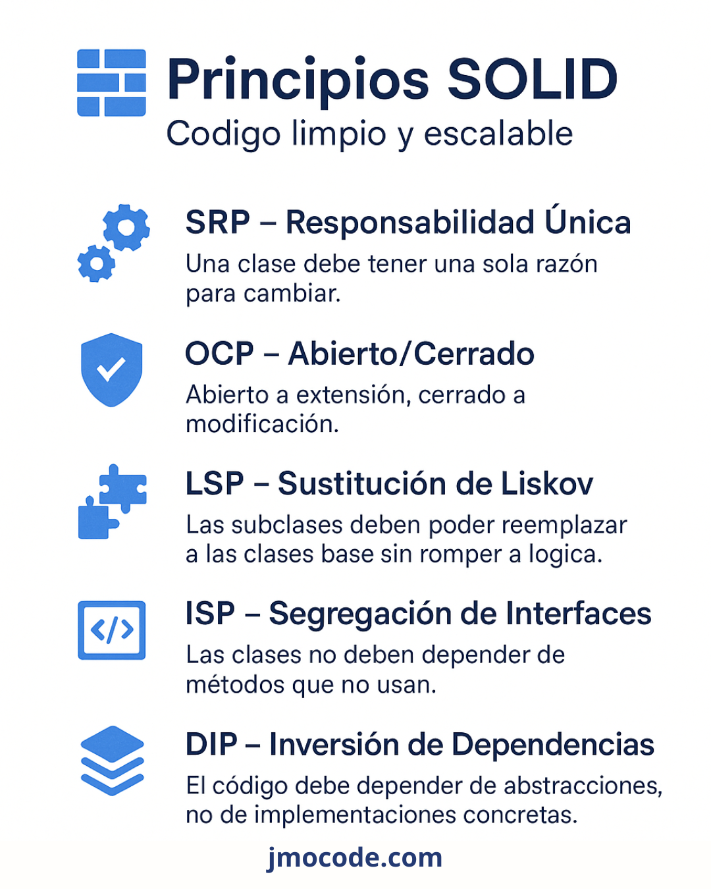

## Principios SOLID

### Principio de Responsabilidad Única (SRP)

**Definición**: Cada módulo o clase debe tener una única razón para cambiar.

La Separación de Responsabilidades (SoC) va de la mano: divide el sistema en partes con responsabilidades distintas.

#### 📌 Ejemplo en Python (malo vs. bien)

❌ **Violación de SRP**: mezcla lectura y compresión

```python
class FileManager:
    def __init__(self, filename):
        self.filename = filename

    def read(self):
        # lee archivo
        pass

    def write(self, data):
        # escribe archivo
        pass

    def compress(self):
        # comprime archivo
        pass

    def decompress(self):
        # descomprime archivo
        pass
```

✅ **Solución**: separa responsabilidades:

```python
class FileManager:
    def __init__(self, filename):
        self.filename = filename

    def read(self): pass
    def write(self, data): pass

class Compressor:
    def compress(self, filename): pass
    def decompress(self, filename): pass
```

### Principio Abierto-Cerrado (OCP)

**Definición**: Los módulos deben estar abiertos a extensión, pero cerrados a modificación.

#### 📌 Ejemplo en Python

❌ **Violación**: cada vez que agregas un formato, modificas la clase

```python
class Report:
    def output(self, format):
        if format == "json":
            # ...
            pass
        elif format == "xml":
            # ...
            pass
```

✅ **Solución**: usa polimorfismo / interfaces:

```python
class Report:
    def __init__(self, formatter):
        self.formatter = formatter

    def output(self, data):
        return self.formatter.format(data)

class JSONFormatter:
    def format(self, data): pass

class XMLFormatter:
    def format(self, data): pass

# Extender: sólo creas nueva clase Formatter, no modifies Report
```

## Principio de Sustitución de Liskov (LSP)

**Definición**: Los objetos de una clase derivada deben poder sustituir a la clase base sin cambiar el comportamiento.

#### 📌 Ejemplo en Python

❌ **Violación**:

```python
class Bird:
    def fly(self): pass

class Sparrow(Bird):
    def fly(self): pass  # correcto

class Penguin(Bird):
    def fly(self):
        raise NotImplementedError
# ❌ Violación: Penguin no puede volar, rompe el contrato de la clase base
```

✅ **Solución**: reorganiza la jerarquía:

```python
class Bird: pass

class FlyingBird(Bird):
    def fly(self): pass

class Sparrow(FlyingBird): pass
class Penguin(Bird): pass
```

## Principio de Segregación de Interfaces (ISP)

**Definición**: Los clientes no deben depender de interfaces que no usan.

#### 📌 Ejemplo en Python

❌ **Violación**:

```python
class Worker:
    def work(self): pass
    def eat(self): pass

class Robot(Worker):
    def work(self): pass
    def eat(self): raise NotImplementedError  # ❌ Violación de ISP
```

✅ **Solución**: define interfaces segmentadas:

```python
class Workable:
    def work(self): pass

class Eatable:
    def eat(self): pass

class Human(Workable, Eatable):
    def work(self): pass
    def eat(self): pass

class Robot(Workable):
    def work(self): pass
```

## Principio de Inversión de Dependencias (DIP)

**Definición**: Los módulos de alto nivel no deben depender de los de bajo nivel, ambos deben depender de abstracciones.

#### 📌 Ejemplo en Python

❌ **Violación**: Acoplamiento directo

```python
class MySQLDatabase:
    def connect(self): pass

class UserRepository:
    def __init__(self):
        self.db = MySQLDatabase()

    def get_user(self, id):
        self.db.connect()
        # ...
```

✅ **Solución**: depende de una abstracción:

```python
from abc import ABC, abstractmethod

class Database(ABC):
    @abstractmethod
    def connect(self): pass

class MySQLDatabase(Database):
    def connect(self): pass

class UserRepository:
    def __init__(self, db: Database):
        self.db = db

    def get_user(self, id):
        self.db.connect()
        # ...
```

## Resumen de SOLID

| Principio | Qué logra                                       | Ejercicio práctico                 |
| --------- | ----------------------------------------------- | ---------------------------------- |
| SRP       | Clases con responsabilidad única                | Refactorizar FileManager           |
| OCP       | Sistema extensible sin alterar código existente | Añadir formatos a Report           |
| LSP       | Subclases compatibles con superclases           | Reorganizar jerarquías de pájaros  |
| ISP       | Evitar interfaces "hinchadas"                   | Dividir Worker en Workable/Eatable |
| DIP       | Acoplamiento a abstracciones                    | Inyectar Database en repositorio   |


